<div align="center">

<!-- Cyberpunk Header -->
<div align="center">
  
</div>

<a href="https://git.io/typing-svg">
  
</a>

<br/>

*`// CSE @ JSS Science and Technology University | Batch 2025–2029`*

</div>

---

## `> whoami`

```c
typedef struct Engineer {
    char   name[]       = "Nipun Deept";
    char   focus[]      = "Systems Architecture & Backend Engineering";
    char   university[] = "JSSSTU — CSE (2025–2029)";
    bool   loves_memory_management = true;
    int    current_year = 1;
} Engineer;

/* I bypass the high-level noise.
   I talk to the metal. */
```

```md
🧠 Learning: Data Structures & Algorithms, Computer Systems, and Software Engineering fundamentals
⚡ Interests: Memory management, problem solving, and understanding how computers work
🔍 Exploring: Backend development, and open-source software
🤝 Open to: Learning opportunities, collaborations, meaningful projects
```


---

## `> cat tech_stack.cfg`

**[ LANGUAGES ]**


**[ INFRASTRUCTURE & TOOLS ]**


---

## `> ls -la ./projects`

### ⚙️ ModularPong — *Custom 2D Game Engine*

```
┌─────────────────────────────────────────────────────────┐
│  ENGINE SPECS                                           │
│  ─────────────────────────────────────────────────────  │
│  Language   :  C11 (zero abstraction, raw metal)        │
│  Renderer   :  Raylib                                   │
│  Build Sys  :  CMake                                    │
│  Loop       :  Hard-coded 60 FPS continuous game loop   │
│  Physics    :  Algorithmic Circle-to-Rectangle AABB     │
│  AI         :  Reactive math-based CPU opponent         │
│  State Mgmt :  Custom Finite State Machine (FSM)        │
└─────────────────────────────────────────────────────────┘
```

---

## `> neofetch --stats`

<div align="center">


</div>

<div align="center">


</div>

---

## `> cat activity_grid.log`

<div align="center">


</div>

---

## `> ping nipundeept`

<div align="center">

```
PINGING nipundeept... connection established.
```

<a href="mailto:nipdeept@gmail.com">
  
</a>
&nbsp;
<a href="https://github.com/nipundeept">
  
</a>
&nbsp;
<a href="https://leetcode.com/u/nipundeept/">
  
</a>

<br/><br/>

```
> CONNECTION TERMINATED.
> SESSION LOG SAVED.
> GOODBYE, HUMAN.
  ___________
```

</div>

---

<div align="center">
  
</div>
